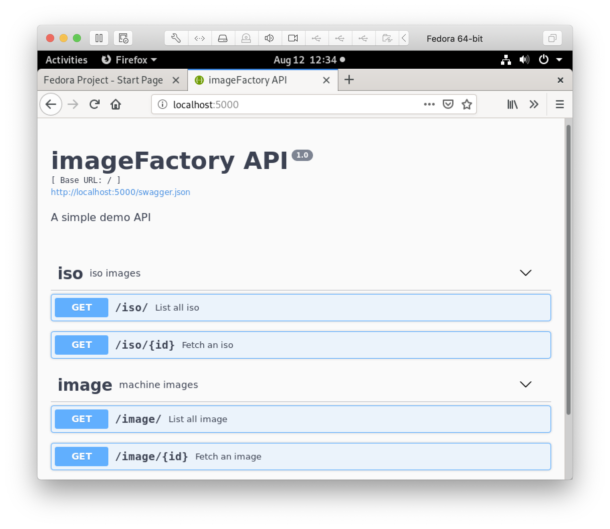

# loki
Preparing for ragnarok

## API metalGate


- MVP imageFactory API utilizing flask-restplus

## Try it Out
### Catalog of ISO
```
curl -x GET "http://localhost:5000/iso/" -H "accept: application/json"
```

### Unique ISO
```
curl -X GET "http://localhost:5000/iso/centos" -H "accept: application/json"
```

## Authors
"Joel E Carlson" <joel.elmer.carlson@gmail.com>
